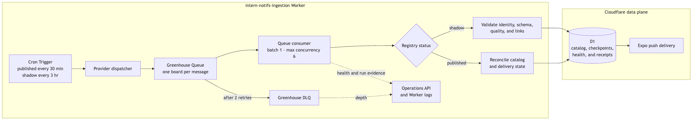

# Greenhouse monitoring architecture

The source is [architecture.mmd](architecture.mmd); a scalable
[SVG rendering](architecture.svg) is included as well.

## Deployment boundary

Greenhouse monitoring runs in the `intern-notifs-ingestion` Worker. That Worker
owns Cron dispatch, the Greenhouse Queue consumer, and ingestion observability;
both Workers share D1 through explicit bindings, while the public API Worker
owns no provider schedules or consumers.

Use the exact two-Worker OpenTofu procedure in
[`../DEPLOYMENT.md`](../DEPLOYMENT.md#api-and-ingestion-deployment-boundary).
Never deploy a bare Wrangler configuration as a provider-only shortcut.

## Runtime flow

Cloudflare Cron Triggers invoke the dispatcher every thirty minutes. The dispatcher
creates one FIFO message for every reviewed Greenhouse board. Each board ID is
its own message group, which prevents overlapping work for the same board while
allowing different boards to run concurrently.

The Cloudflare Queue consumer receives one board per batch and scales to six
consumer invocations. Per-source leases prevent overlap, and failed messages
retry twice before reaching the Greenhouse DLQ.

Published boards run every thirty minutes whether their current snapshot is
active or quiet. Shadow boards run every three hours; their first checks are
staggered across dispatcher windows. A pause or provider backoff overrides both
cadences.

Shadow and published boards deliberately use different D1 checkpoint
keys. Shadow polling validates API shape, role mapping, source quality, and
eligible application links but never writes jobs or sends alerts. When a board
is promoted, it has no published checkpoint, so its first catalog run becomes a
quiet baseline instead of alerting every role already open.

Greenhouse ETags make unchanged checks cheap; Lever always retrieves the full
paginated board and uses a stable content hash because its public endpoint does
not honor conditional requests. A changed published snapshot passes through
canonicalization and the shared catalog-admission evaluator before storage or
notification matching. Each source occurrence retains its reviewed canonical-
employer evidence, provider and posting identity, destination classification
and evidence, metadata-completeness result, eligibility flags, and reason codes.
The canonical job is derived from all open occurrences: a valid official
occurrence can repair a bad community occurrence, while conflicting official
employer evidence blocks publication.

Reviewed standard Greenhouse, Lever, and Ashby routes may be admitted when the
tenant and posting ID match even if an automated fetch is blocked. Custom routes
need visible single-role browser evidence; aggregate boards and confirmed-gone
pages quarantine immediately. A previously good custom route gets a seven-day
catalog grace period when it becomes inconclusive, measured from its last
successful exact-role verification (not a failed retry); that verification time
is public while the role remains browsable, and alerts pause immediately.
Browser Rendering work runs through the destination-verification queue and DLQ,
retains bounded evidence and attempts in D1, retries incidents daily, and samples
reviewed host rules weekly.

Published provider work records catalog and delivery state in D1. Scheduled
maintenance reconciles Expo receipts and the optional ntfy fallback without the
retired SSM cohort or a provider-specific deployment stack.

## Capacity and failure boundaries

- Schedule: every thirty minutes for published boards; every three hours for shadow boards.
- Cloudflare Queue batch size: one board.
- Cloudflare Queue maximum concurrency: six consumer invocations.
- Per-message deadline: five minutes; timed-out work is recorded as a retryable
  transport failure instead of holding a consumer slot until the platform limit.
- Queue retries: two. A source-scoped failure that survives the final delivery
  records its health where a poll ran plus its failure-ledger rows, then is
  acknowledged, because the dispatcher re-issues the source from its health row
  and checkpoint. Acknowledged failures resolve their failure-ledger rows, so the
  unresolved count tracks pending and dead-lettered work only. Only a message the
  dispatcher cannot re-own (an unknown source or a malformed body) dead-letters.
- Greenhouse API timeout: eight seconds per identity or admission request, and
  fifteen seconds per board fetch, which covers headers and the whole body.
- Queue retention: one day.
- Dead-letter retention: fourteen days.
- Dead-letter threshold: three total attempts; catalog dead letters are poison only.

Worker observability and the operations API surface invocation failures, stale
sources, queue age, and any message arriving in the Greenhouse DLQ, which now
holds poison only.
