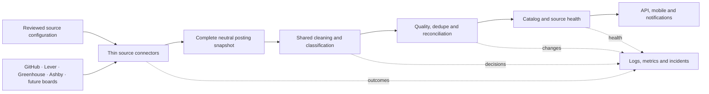

# Standardized job ingestion architecture

## Goal

All production sources cross one provider-neutral boundary before catalog
policy is applied. Connectors prove that a snapshot is complete and preserve
provider identity; shared processing owns cleaning and eligibility; pure
reconciliation decides catalog changes; persistence only stores those changes.

This refactor deliberately preserves existing source IDs, URL/fingerprint job
IDs, eligibility decisions, quiet baselines, and notification behavior.
Eligibility improvements ship separately after compatibility is proven.

## Contracts

A `SourceConnector` returns a complete `SourceSnapshot`. Each
`SourcedPosting.externalId` is stable within its source: ATS posting IDs for
Lever, Greenhouse, and Ashby, and document path plus normalized application URL for
Markdown. Two Markdown rows that share one normalized application URL are one
destination, so the repeat is dropped and still counted in `rawCount` rather
than failing the snapshot. Row numbers remain diagnostics only.

Connectors own transport, pagination, schema validation, source identity,
completeness, stable provider IDs, and reviewed URL contracts. They classify
failures so the runner can retry transport, `429`, and `5xx` and quarantine
configuration, schema, identity, and URL-contract failures. They do not decide
whether a structurally valid posting is a technical early-career role.

The shared processor returns processed listings and an explicit decision for
every posting. It owns text cleanup, generic URL safety, work-mode/location
normalization, lifecycle and technical classification, season inference,
compensation, and declared requirement extraction. `lifecycleAuthority` records
where the lifecycle signal comes from: `title` requires explicit internship,
co-op, apprenticeship, new-grad, or entry-level wording; `posting` trusts a
provider field that explicitly marks that row as an internship; and `source`
trusts a reviewed early-career-only document for every row it lists. A generic
technical title, experience-range prose, or “junior” alone never qualifies.

The reconciler is pure. It calculates creates, updates, first omissions,
second-omission closures, and deterministic notification events. One snapshot
that lists a role twice — across documents or behind different tracking links —
merges into one role with one alert. A role remains open while any source
occurrence is open. Failed, incomplete, malformed, or suspicious raw-zero
snapshots never reach reconciliation.

The store persists catalog records, occurrences, checkpoints, deterministic
outbox records, and source health. An occurrence is written only when its
presence, omission streak, role, or payload changes; a confirmation costs no
write because the checkpoint carries the active ID set. Recording an outbox
event is the alert gate, so a retried snapshot re-derives the same event ID and
stays quiet. Checkpoints advance only after all writes for a snapshot succeed.
Store indexes use the already-processed catalog state and never re-run
classification.

### Catalog and source time facts

Catalog timestamps and provider timestamps answer different questions and are
never substituted for one another:

- `Internship.firstSeenAt` is the immutable time InternNotifs first observed the
  canonical job. It is not a provider creation or publication time.
- `Internship.catalogVisibleAt` is the immutable time that canonical job became
  visible in the InternNotifs catalog. `catalogRecency=normal` sorts by this
  value; `baseline` remains browseable but sorts after every normal job.
- `SourceOccurrenceState.firstObservedAt` is when InternNotifs first observed
  that source-local posting. Its precision field marks legacy unknowns.
- `SourceOccurrence.firstAttachedAt` is when that source occurrence was first
  attached to the canonical catalog job. Attaching a provider baseline to an
  existing community job does not change the job's catalog timestamps or rank.
- `SourceOccurrence.providerTimestamp` retains the provider's declared
  `published` or `updated` semantics. In particular, an `updated` value is never
  converted into a creation, observation, attachment, or visibility time.

The open sparse-index key starts with the recency rank and then uses
`catalogVisibleAt#jobId`. Normal rows use rank `3`; baseline rows use rank `1`.
This makes one descending query return every normal role before any baseline
role. Legacy unranked normal keys remain readable during rollout and the catalog
index audit canonicalizes them.

## Compatibility and rollout

Migration order is Greenhouse, Lever, general GitHub Markdown, then Quant
Markdown. During migration, `RawListing` remains a deprecated alias for
`ProcessedListing`, and the legacy `SourceAdapter`/`SourceFetchResult` names
remain aliases for the neutral connector contract where callers still need
them.

The first trusted snapshot for a source is always quiet. Unchanged successful
snapshots are healthy and can advance omission streaks because they confirm
the same complete active snapshot; they reconcile omissions only, so identical
source content never rewrites the catalog. One omission marks an occurrence
missing; the second consecutive complete success closes it. Updates never
become new job alerts.

## Runtime and deferred scaling

The existing poll Lambda remains the orchestrator. Greenhouse keeps its
SQS-backed shadow/published scheduling, Ashby's five reviewed boards remain
adapter-only and shadow-only pending their runtime issue, and Firecrawl remains discovery-only.
Per-source queues for every provider, dynamic operator configuration, and a
management UI are deferred until source volume requires them.

Source health records and structured events make unchanged success, transient
provider failure, rejected snapshots, persistence failure, and stale sources
distinct. Metrics use provider/outcome/category dimensions; source IDs stay in
logs and health records to avoid unbounded metric cardinality.

Provider admission and incident response remain provider-specific:

- [Lever company onboarding](lever-company-onboarding-plan.md)
- [Lever monitoring and recovery](lever-monitoring-plan.md)
- [Greenhouse operations](greenhouse/README.md)
- [Ashby discovery, admission, and adapter](ashby-onboarding.md)

## Ingestion V2 foundation (Stage 1)

`docs`/plans describe fault-isolated ingestion as three gated stages. Stage 1 is
the additive foundation and side-effect-free shadow discovery. It cannot create
a job, occurrence, notification, or admission write. Legacy ingestion remains
authoritative while the separately gated Stage 2 lane records non-publishing
admission decisions.

- `cloudflare/migrations/0045_ingestion_v2.sql` adds `ingestion_snapshots`,
  `ingestion_rows`, and `ingestion_v2_shadow_comparisons`. Nothing legacy is
  altered; the migration is re-runnable.
- `src/ingestion-v2/` holds the pure contracts: `normalize.ts` (deterministic,
  order-independent snapshot and material hashing), `diff.ts` (full-board diff),
  and `shadow-discovery.ts` (orchestration). The D1 repository and R2 snapshot
  store live in `cloudflare/ingestion-v2-store.ts`.
- The runner invokes the shadow hook at `src/poll.ts` after the legacy fetch
  passes `sourceQualityFailures` and before any legacy admission write. The hook
  never throws: a shadow failure is logged as `ingestion_v2_shadow_failed` and
  the legacy delivery proceeds.
- `INGESTION_V2_SHADOW_DISCOVERY_ENABLED` (default `false`) gates the whole
  feature; `INGESTION_V2_SHADOW_SOURCE_ALLOWLIST` optionally bounds rollout to a
  comma-separated set of source IDs.
- Shadow mode writes only its own D1 state, a content-addressed R2 object under
  `ingestion-v2/snapshots/<source-id>/<snapshot-hash>.json`, and a per-source
  comparison. It never enqueues admission, mutates a checkpoint, or touches the
  catalog.
- Snapshot reads validate the envelope counts, canonical row order, unique
  identities, posting source/provenance, first-observation eligibility, each
  material hash, and the complete snapshot hash before any row is trusted.

The full-board diff compares every normalized row against the compact ledger and
classifies it as `new`, `changed`, `stale-policy`, `retryable`, `unchanged`,
`reappeared`, or `missing`. New, changed, stale-policy, reappeared, and due-retry
rows are actionable; unchanged settled rows are not. Missing rows increment
omissions only after a complete snapshot and become `absent` on the second
consecutive complete miss. Incomplete or failed snapshots neither activate nor
advance omissions. A repeated identical snapshot produces an empty actionable
set and rewrites nothing. If content changes from A to B and later returns to A,
the retained immutable A snapshot becomes active again atomically, its old
terminal/expiry markers are cleared, and B becomes terminal.

The protected `GET /internal/operations/ingestion-v2` endpoint returns the latest
shadow comparison per source (or one source with `?sourceId=`). It requires the
`X-Operations-Key` header and is otherwise a 404.

## Ingestion V2 fault-isolated admission (Stages 2 and 3)

Stage 2 added a dedicated `intern-notifs-admission-v2` queue and DLQ and makes
each ledger row settle, retry, or quarantine independently. It stays
feature-flagged and, before Stage 3 cutover, runs in verification mode: the
catalog writer is replaced by a recorded decision sink, so admission writes
ledger state and captures the decision it would have published without mutating
the live catalog.

- `cloudflare/migrations/0046_ingestion_v2_admission.sql` adds
  `ingestion_admission_handoffs`, the durable dispatch receipt. Migration `0047`
  adds the round-robin source cursor and sanitized non-publishing canary receipts.
  Forward migration `0048` adds the notification baseline and durable effect-claim
  marker to databases that already recorded the original `0045`; applied migration
  files are never rewritten. The lease, attempt, retry, decision, and failure
  columns already live on `ingestion_rows`.
- `src/ingestion-v2/admission/` holds the pure contracts and orchestration:
  `message.ts` (versioned message, deterministic batch ID, 25-ID limit,
  canonical ordering), `taxonomy.ts` (business/row-transient/infrastructure
  classification and the 60 s / 5 min retry schedule), `transitions.ts` (the row
  state machine), `dispatcher.ts`, `consumer.ts`, `migration.ts`, `operations.ts`,
  `evaluator.ts` (reuses `processPosting`, `classifyDestination`, and
  `evaluateCatalogAdmission`), `recording-sink.ts`, and the reconciler-backed
  catalog sink exercised by integration tests.
- The scheduled dispatcher finds pending rows and stale queued rows with no valid
  handoff receipt, commits them `queued`, records a handoff, and hands bounded
  messages to the queue. A failed send leaves the rows recoverable once the
  handoff goes stale. A durable round-robin cursor keeps the bounded 500-source
  scan fair when the active source set grows beyond one page.
- The consumer reads the referenced snapshot once per batch, leases each row with
  the message's snapshot/material/policy intent, and lets each row settle,
  schedule a retry (initial attempt plus two), or quarantine. A duplicate, stale,
  or contended delivery is a no-op. A systemic failure (missing R2 object, D1
  unavailability, incomplete snapshot) releases the lease, records a sanitized
  `queue_failure_events` row, retries the delivery, and never consumes a row
  attempt or quarantines a row. The protected DLQ plan/apply surface accepts
  validated admission messages for exact replay after repair.
- Admission grading returns catalog and notification work as a deferred effect.
  After network evaluation, the consumer atomically claims the exact leased
  snapshot/material/policy identity in D1 and only then invokes the idempotent
  sink. A replacement observed during evaluation makes the claim fail, so the
  old effect is never published; a replacement after the claim is ordered after
  that effect and remains queued for its own evaluation.
- The Cloudflare destination probe retains and parses a bounded 128 KiB HTML
  prefix. Standard provider routes still classify from reviewed identity, while
  company-hosted forms receive the same title, posting, structured-data, form,
  closure, and truncation evidence used by the existing admission rules.
- Admission loads the prior occurrence identity, admission decision, and trusted
  qualification before grading. Reviewed trusted-community policy may admit a
  source-reported employer for catalog visibility while keeping alerts disabled;
  other unresolved mappings remain deterministic business decisions. A D1
  resolver failure retries the delivery as infrastructure. The V2 evaluator
  version includes this policy behavior so a change reopens stale rows without a
  direct ledger edit.
- Row reopening is change-driven. When admission is enabled the shadow pass hands
  the diff's `new`, `changed`, `stale-policy`, and `reappeared` IDs back to the
  lane, so a row whose material content, policy version, or presence changed
  becomes dispatchable work. A new material identity clears the old lane state,
  lease, retry budget, decision, and failure before the fresh identity is
  reopened; guarded terminal writes keep an old evaluator from committing over
  it. Admission ownership follows material and policy identity rather than the
  whole-board snapshot hash: an unrelated peer addition advances the row's
  current snapshot pointer while preserving its retry, quarantine, decision,
  lease, and notification state. An old leased message then fails its snapshot
  fence and the current pointer is reissued after lease expiry. A due retry for
  unchanged material keeps its attempt count. An authorized operator can also
  reopen one row through the guarded replay route.
- Bulk reopening uses at most 96 IDs plus four fixed parameters per statement,
  staying within D1's 100-parameter limit for discovery and 200-row migration
  slices. Lease acquisition also enforces `retry_at`, so duplicate messages
  before either backoff deadline are safe no-ops.
- A shadow-first rollout is bootstrapped explicitly. Rows observed while their
  source is outside the admission rollout retain a durable notification baseline;
  the dispatcher reopens bounded batches that have never completed V2 admission,
  even when the board is unchanged, and their messages remain silent.
- The scheduled dispatcher runs a bounded per-source policy migration before it
  dispatches: stale settled rows are reopened under the active snapshot's
  admission version in bounded batches, without hiding previously visible roles,
  clearing a job identity, or setting a source-wide suppression. New eligible
  rows dispatch on their own while stale peers are still being regraded.
- Notification fencing is enforced at the effect boundary. Baseline work and any
  row that already owns a catalog job (policy migration or re-admission) commit
  with `notify: false`; only a genuinely new post-baseline role may mint a
  notification. Policy migration persists the same baseline fence even for a
  previously blocked or shelved row with no job ID. The D1 verification sink
  retains one sanitized receipt per source, row, and admission version so a
  canary can prove zero notifications without a live catalog writer.
- Discovery stamps that same silent baseline before replacing a stale policy
  version, closing the race where discovery could otherwise outrun the scheduled
  migration pass. D1/database/storage error markers are classified before
  generic timeout or HTTP wording, so systemic faults retry the delivery without
  consuming a row attempt.
- Replaced snapshots remain active while pending, queued, or processing rows
  still reference them. The final acknowledged handoff terminalizes a settled
  superseded snapshot and assigns seven days of retention for replay/audit.
- `INGESTION_V2_ADMISSION_ENABLED` (default `false`) gates admission;
  `INGESTION_V2_ADMISSION_SOURCE_ALLOWLIST` optionally bounds rollout. The
  dispatcher only produces messages for sources on the allowlist. The consumer
  drains and acknowledges durable handoffs without leasing or evaluating rows
  while the global flag is disabled, and acknowledges other sources as no-ops.
- `GET /internal/operations/ingestion/rows?sourceId=&state=&cursor=` returns a
  bounded, sanitized page plus a source overview (pending/queued/processing/
  settled/quarantined/absent, oldest work, current snapshot).
  `POST /internal/operations/ingestion/rows/replay` previews with
  `{ sourceId, externalId }` and applies only when the returned `replayToken`
  is echoed back; it refuses an in-flight row and verifies the ID against the
  immutable retained R2 snapshot before issuing a token. Both require
  `X-Operations-Key` and are otherwise a 404.

### Stage 3 bootstrap and source-scoped catalog ownership

Stage 3 selects the reconciler-backed writer without introducing a second live
writer. Migration `0049_ingestion_v2_bootstrap.sql` stores an immutable bootstrap
receipt. `POST /internal/operations/ingestion/bootstrap` first returns a dry-run
whose HMAC guard covers the paused source status, checkpoint, active snapshot,
ledger counts, active/actionable counts, visibility estimate, and 15-minute
expiry. Apply requires the exact token and expected counts. One D1 batch marks
the active rows as a silent baseline, clears legacy pending migration fields,
stamps the snapshot admission version in the checkpoint, and records the
receipt. Repeating the same completed bootstrap is a zero-change success.

Live ownership uses independent, default-empty source controls:

- `INGESTION_V2_CATALOG_WRITER_ENABLED` plus
  `INGESTION_V2_CATALOG_WRITER_SOURCE_ALLOWLIST` select the live V2 sink.
- `INGESTION_V2_LEGACY_CATALOG_WRITE_DISABLED_SOURCE_ALLOWLIST` transfers the
  source's catalog-write ownership only when shadow discovery, V2 admission, and
  the live writer are all enabled for that same explicit source. The legacy
  poll still fetches, applies source-quality gates, records a complete V2
  snapshot, and updates source health/checkpoint state; it skips catalog,
  occurrence, and notification writes.
- `INGESTION_V2_TRUSTED_COMMUNITY_ALERT_SOURCE_ALLOWLIST` independently enables
  the reviewed `exact-identity-or-two-complete-snapshots` alert policy. It is
  effective only for a V2-owned source and participates in the durable V2
  evaluator version. Existing bootstrap and policy-migration rows stay silent.

Removing the legacy-disable source entry restores legacy write ownership without
removing additive V2 tables or R2 snapshots. Disabling admission drains handoffs
without evaluating rows. The complete cohort sequence and rollback checks are in
[`ingestion-v2-stage3-cutover.md`](ingestion-v2-stage3-cutover.md).

The end-to-end suite covers the lane by seeding dispatchable rows and by driving
real deliveries through the built Worker. Two writers share `ingestion_rows`, so
the shadow upsert preserves admission-lane state (`pending`, `queued`,
`processing`, `quarantined`) for the same admission identity and omission
increments skip a leased `processing` row. A new identity clears the old lane
state before the shadow callback or scheduled bootstrap reopens it.
